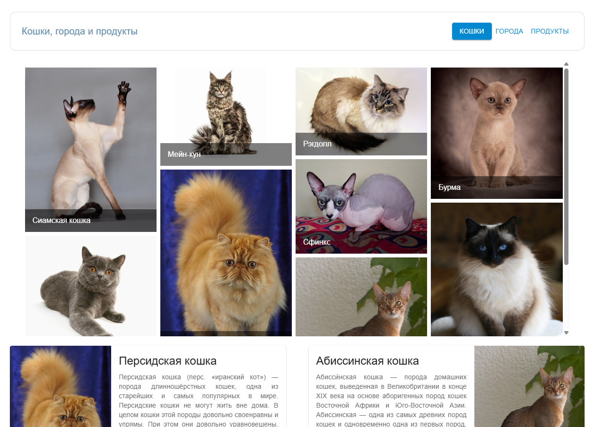
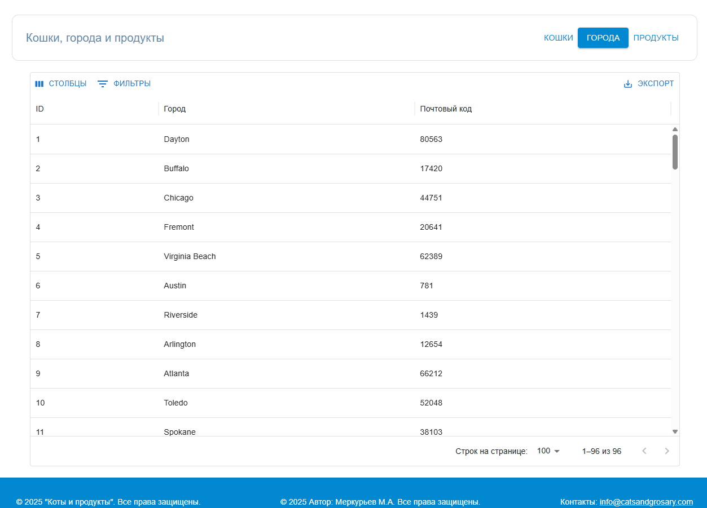
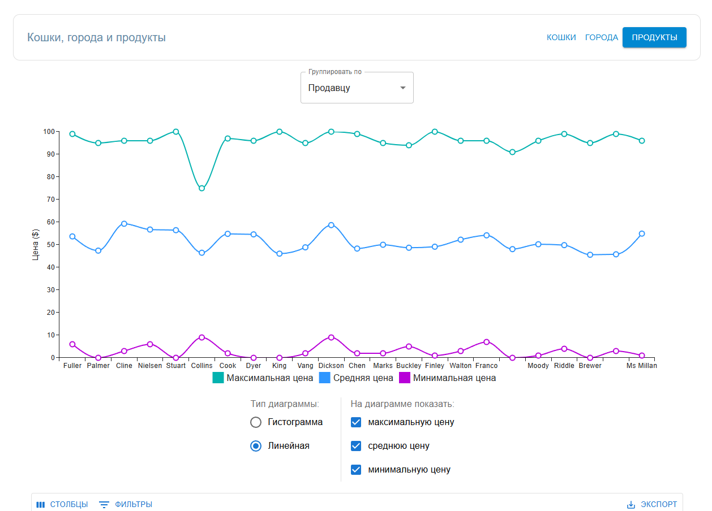
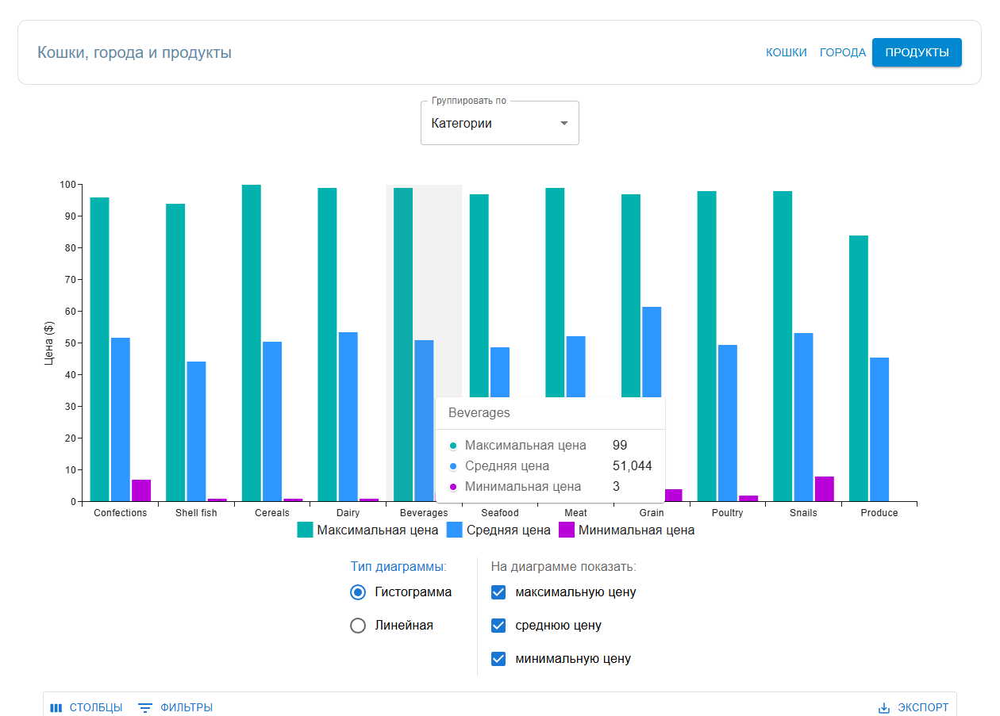

# 🌐 Full Stack Web App: Flask + React

[](https://github.com/Bit-Maximum/Full-Stack-Web-App/blob/main/README.md)
[](https://github.com/Bit-Maximum/Full-Stack-Web-App/blob/main/translation/README.ru.md)

🧪 _A project developed as part of the course "Engineering of Internet Systems"_  
🧱 A full-fledged full-stack web application, developed step-by-step through three practical assignments.  
📦 Consists of a backend (Python + Flask + REST API) and a frontend (React + MUI), integrated via Docker Compose.

---

## 📚 Project Goal

To build a fully functional client-server application — from API design to frontend implementation and containerized deployment.

The project was completed in 3 main stages:

| Stage | Title             | Description |
|------|----------------------|------------------|
| 1    | Backend (API)        | Реализация REST API на Flask, работа с Kaggle-датасетом |
| 2    | Frontend (React SPA) | Web UI built with React and Material UI |
| 3    | 	Integration   | Connecting frontend to backend and testing interactions |

---

## 🛠️ Technologies Used

**Backend:**
- Python 3
- Flask + Flask-RESTful
- CORS, JSON serialization

**Frontend:**
- React
- MUI (Material UI)

## ▶️ Quick Start with Docker

### Prerequisites
- Установленный [Docker](https://docs.docker.com/get-docker/)
- Установленный [Docker Compose](https://docs.docker.com/compose/install/)

### 📝  Instructions
1. Clone the repository:
```bash
git clone https://github.com/Bit-Maximum/Full-Stack-Web-App.git
cd Full-Stack-Web-App
```

2. Build and start the project:
```bash
docker-compose up --build
```

The application will be available at:
http://localhost:3000

>_The frontend will send API requests to the backend available at http://localhost:5000 inside the container.._

## 🔍 View Individual Development Stages

### To view the REST API implementation (backend), check out the `stage-1-backend` branch:
[backend/README.md](https://github.com/Bit-Maximum/Full-Stack-Web-App/blob/stage-1-backend/backend/README.md)

### To view the frontend implementation (React SPA), check out the `stage-1-backend` branch:
[backend/README.md](https://github.com/Bit-Maximum/Full-Stack-Web-App/blob/stage-2-frontend/frontend/README.md)

## 💡Service Overview

### 🧩 Backend API:
* REST API built with Flask
* Dataset loaded and processed from Kaggle
* CRUD operations implemented
* Includes error handling and CORS support


### 🧩 Frontend:
* Interface developed with React
* Styled using Material UI
* Includes a table view, filters, and detailed view for items

## 📷 Gallery

</img> </img> </img> </img>

## 👤 Author
Maxim Merkurev
**Far Eastern Federal University, 2025**